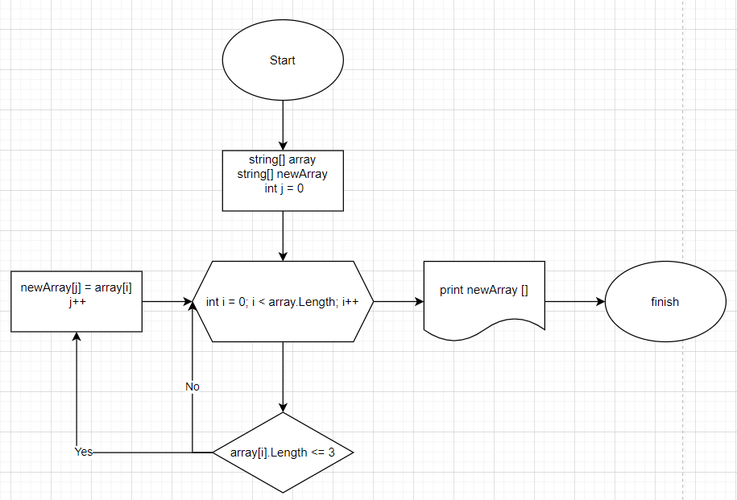

*Задача:*

 Написать программу, которая из имеющегося массива строк формирует новый массив из строк, длина которых меньше, либо равна 3 символам. Первоначальный массив можно ввести с клавиатуры, либо задать на старте выполнения алгоритма. При решении не рекомендуется пользоваться коллекциями, лучше обойтись исключительно массивами.

*Алгоритм решения:*

- Изначально задаем два массива формата "string", где в первом массиве (array) элемменты имеют различную длину, а во втором массиве (newArray) длина каждого элемента должна быть меньше или равна 3. Длина второго массива при создании равна длине первого массива. 
- Затем с помощью цикла "for" проходим по всем элементам первого массива и выполняем проверку условия (<=3). 
- В переменную "n" записываем количество элементов, которые попадут во второй массив. Это нужно для того, чтобы после завершения цикла изменить размер нового массива, так как возможно не все элеметы пройдут по условию.
- Если элемент соответствует условию, то он записывается в "j" элемент нового массива newArray. Счетчиком увеличиваем "j"и переходим к проверке следующего элемента первого массива.
- Если элемент не подходит по условию, то переходим к следующему элементу массива array.
- Так проходим по всему первому массиву.
- В полученном массиве используем метод Array.Resize(), для изменения размера массива.

*Блок-схема алгоритма* представлена на рисунке:

